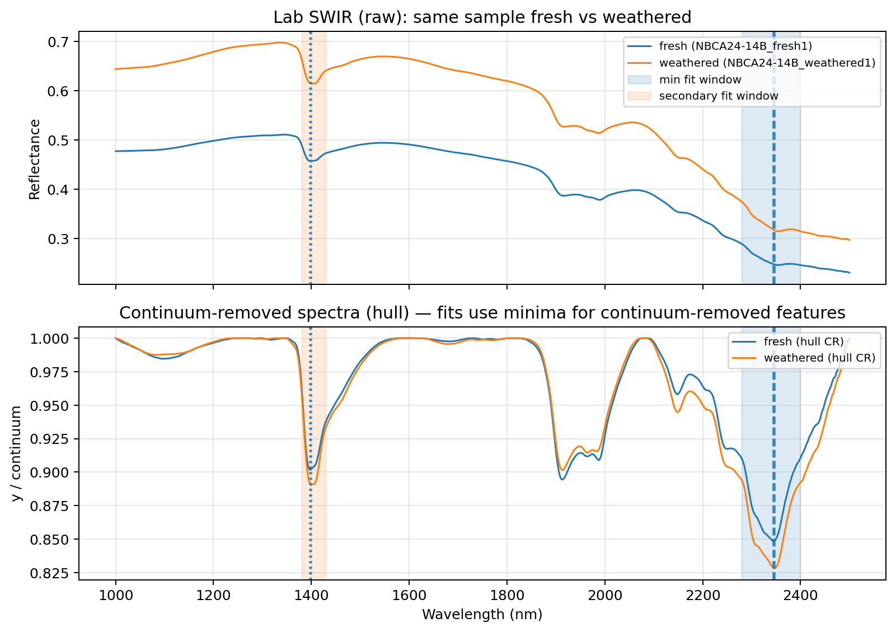
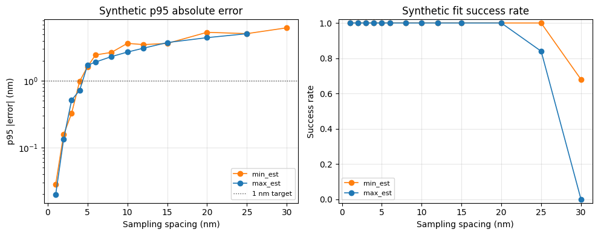
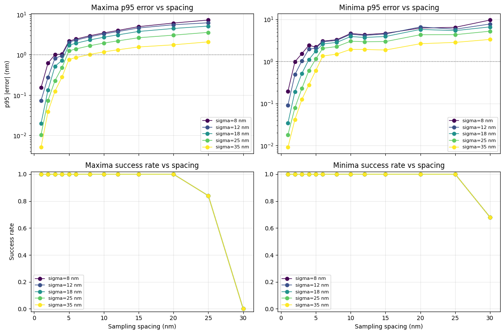
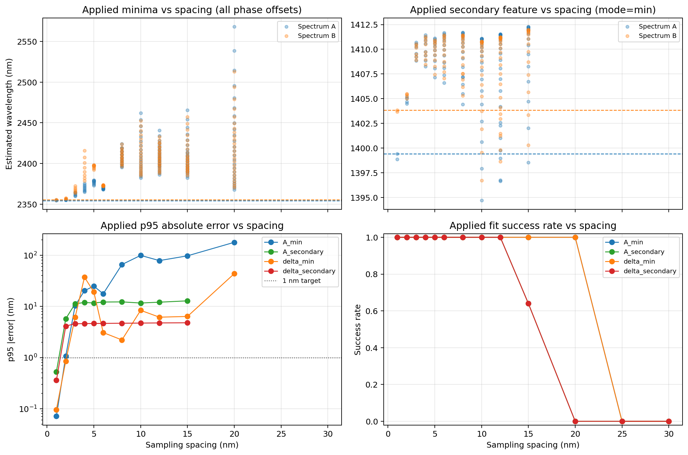
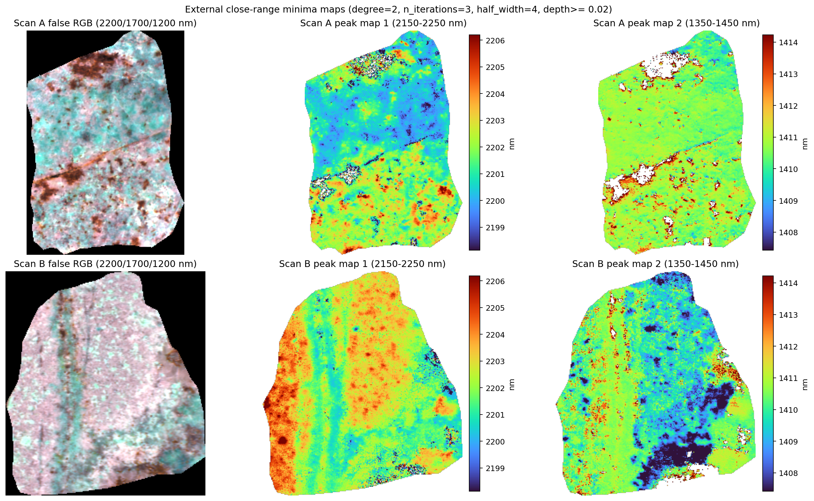
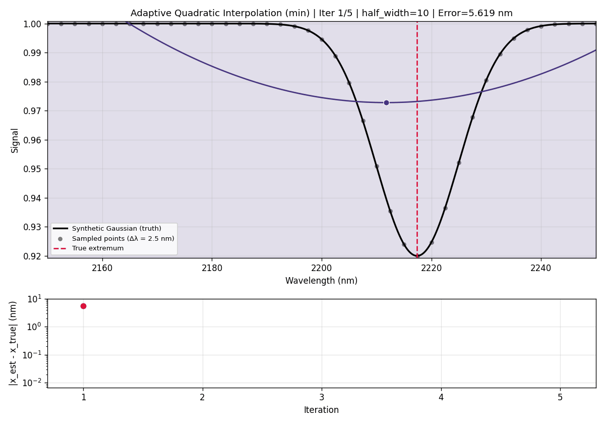
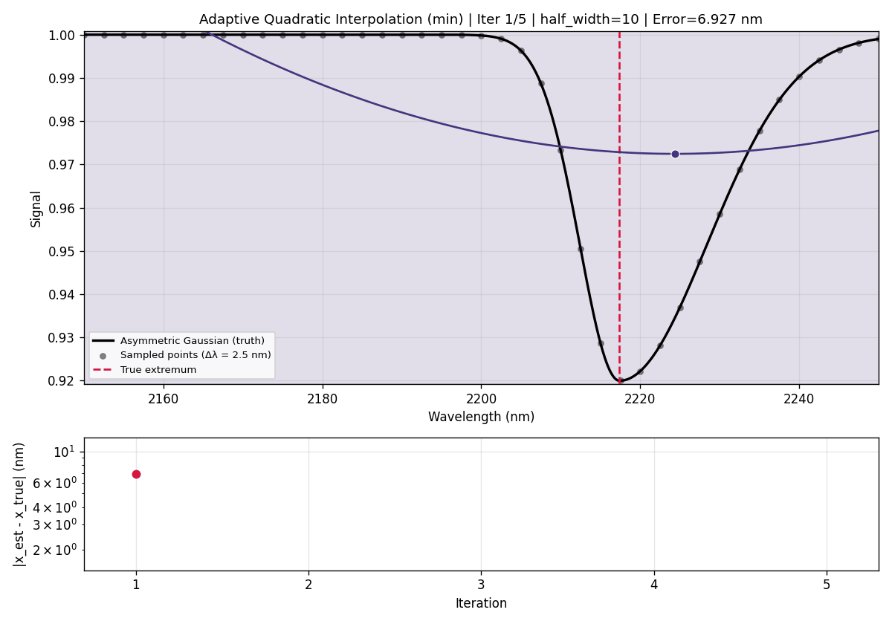
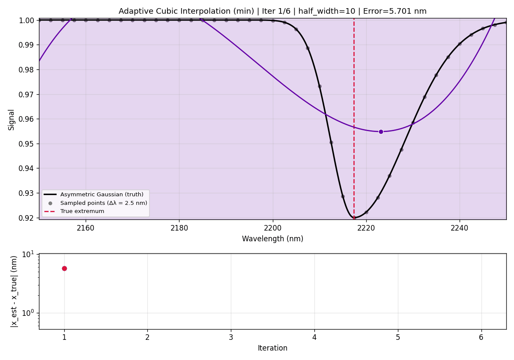
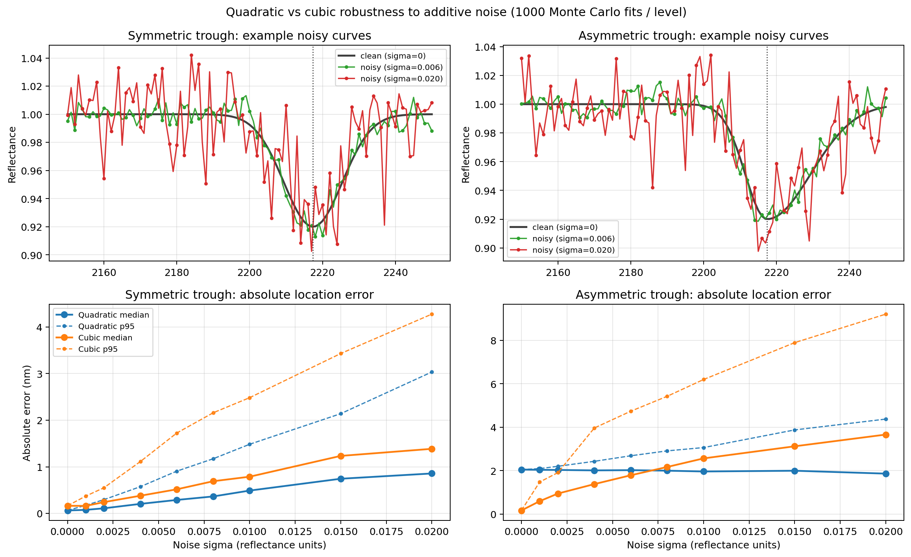

# PeakFit

Fast, practical sub-band extremum mapping for hyperspectral rock data.

## Motivation
In core scanning and close-range SWIR work, small wavelength shifts (often just a few nm) are meaningful. This project focuses on estimating those shifts quickly and consistently across many spectra or full data cubes.

## What This Repo Does
- continuum removal (none, linear, or hull) as a separate preprocessing step,
- local polynomial extremum fitting (quadratic and cubic),
- sampling-spacing and feature-width stress tests,
- full-cube spatial extremum maps,
- side-by-side quadratic vs cubic comparisons.

Core implementation:
- `src/peakfit/continuum.py`
- `src/peakfit/refine.py`
- `src/peakfit/polynomial.py`
- `src/peakfit/cube.py`

## Extremum Model
For a local quadratic fit:

$$
y = a x^2 + b x + c
$$

the analytic extremum is:

$$
x_{\mathrm{ext}} = -\frac{b}{2a}
$$

Cubic fits are also supported and use derivative roots plus curvature checks to select valid extrema.

## Figures From The Notebook
All figures are generated by `notebooks/peakfit_lab_swir.ipynb`.

### 1. Lab SWIR overview (raw + continuum-removed)


### 2. Synthetic spacing stress test (error + success)


### 3. Feature-width vs spacing sensitivity


### 4. Applied two-spectrum spacing test


### 5. Full-cube minima maps: quadratic vs cubic
Quadratic:


Cubic:


### 6. External close-range maps: quadratic vs cubic
Quadratic:


Cubic:


## GIF Demos (Iterative Refinement)
### Symmetric synthetic walkthrough (quadratic)


### Asymmetric synthetic walkthrough (quadratic)


### Asymmetric synthetic walkthrough (cubic)


### 7. Noise robustness (symmetric + asymmetric; absolute + excess error)
This figure combines:
- top row: example noisy curves,
- bottom row: absolute error `|estimated - true|`.



## Run
```bash
uv sync --all-groups
uv run pytest -q tests
uv run jupyter notebook notebooks/peakfit_lab_swir.ipynb
```

## Custom Data Examples
### ENVI (`.hdr` + `.dat`/`.raw`)
```python
from pathlib import Path
import numpy as np
from peakfit import peak_map


def parse_envi_hdr_text(text: str) -> dict[str, str]:
    out: dict[str, str] = {}
    for raw in text.splitlines():
        line = raw.strip()
        if not line or line.lower() == "envi" or "=" not in line:
            continue
        k, v = line.split("=", 1)
        out[k.strip().lower()] = v.strip()
    return out


def envi_dtype(code: int, byte_order: int) -> np.dtype:
    dt_map = {
        1: np.uint8,
        2: np.int16,
        3: np.int32,
        4: np.float32,
        5: np.float64,
        12: np.uint16,
        13: np.uint32,
        14: np.int64,
        15: np.uint64,
    }
    dt = np.dtype(dt_map[code])
    if dt.itemsize > 1:
        dt = dt.newbyteorder("<" if byte_order == 0 else ">")
    return dt


def load_envi_cube(hdr_path: Path, dat_path: Path) -> tuple[np.ndarray, np.ndarray]:
    meta = parse_envi_hdr_text(hdr_path.read_text(errors="ignore"))
    samples = int(meta["samples"])
    lines = int(meta["lines"])
    bands = int(meta["bands"])
    offset = int(meta.get("header offset", "0"))
    interleave = meta.get("interleave", "bil").lower()
    dtype_code = int(meta.get("data type", "4"))
    byte_order = int(meta.get("byte order", "0"))

    wl_text = meta.get("wavelength", "").strip("{} ")
    wavelengths = np.array([float(x) for x in wl_text.split(",") if x.strip()], dtype=np.float64)
    if wavelengths.size == 0:
        raise ValueError("No wavelength list in ENVI header")

    # Convert microns -> nm if needed.
    if wavelengths.max() < 100.0:
        wavelengths = wavelengths * 1000.0

    dt = envi_dtype(dtype_code, byte_order)
    arr = np.fromfile(dat_path, dtype=dt)
    if offset > 0:
        arr = arr[offset // dt.itemsize :]

    expected = lines * samples * bands
    arr = arr[:expected]

    if interleave == "bil":
        cube = arr.reshape(lines, bands, samples).transpose(0, 2, 1)
    elif interleave == "bsq":
        cube = arr.reshape(bands, lines, samples).transpose(1, 2, 0)
    elif interleave == "bip":
        cube = arr.reshape(lines, samples, bands)
    else:
        raise ValueError(f"Unsupported interleave: {interleave}")

    return cube.astype(np.float32, copy=False), wavelengths


cube, wl_nm = load_envi_cube(Path("scan.hdr"), Path("scan.dat"))  # or scan.raw
b0 = int(np.searchsorted(wl_nm, 2150.0, side="left"))
b1 = int(np.searchsorted(wl_nm, 2250.0, side="right"))
peak_nm, valid = peak_map(
    cube,
    wl_nm,
    b0,
    b1,
    degree=2,              # 2 or 3
    n_iterations=3,
    half_width=4,
    mode="min",            # "min" for absorption troughs after CR
    continuum="none",      # or "linear" / "hull"
    output_wavelength=True,
)
```

### NumPy cube (`.npy`)
```python
import numpy as np
from peakfit import load_cube_npy, peak_map

cube = load_cube_npy("cube.npy")                  # shape: (rows, cols, bands)
wl_nm = np.linspace(1000.0, 2500.0, cube.shape[2])  # replace with real wavelengths if available

b0 = int(np.searchsorted(wl_nm, 2150.0, side="left"))
b1 = int(np.searchsorted(wl_nm, 2250.0, side="right"))

peak_nm, valid = peak_map(
    cube,
    wl_nm,
    b0,
    b1,
    degree=3,
    n_iterations=3,
    half_width=4,
    mode="min",
    continuum="none",
    output_wavelength=True,
)
```

### Plot the peak map
```python
import numpy as np
import matplotlib.pyplot as plt

# peak_nm, valid come from peak_map(...)
peak_plot = np.where(valid, peak_nm, np.nan)

# Robust color limits for stable visual comparison.
vmin, vmax = np.nanpercentile(peak_plot, [2, 98])

plt.figure(figsize=(8, 5))
im = plt.imshow(peak_plot, cmap="turbo", vmin=vmin, vmax=vmax)
plt.title("Peak position map (nm)")
plt.axis("off")
plt.colorbar(im, label="Wavelength (nm)")
plt.tight_layout()
plt.show()
```

## Docker CI Stages
```bash
# Lint (ruff)
docker build --target lint -t peakfit:lint .

# Build wheel/sdist
docker build --target build -t peakfit:build .

# Run tests
docker build --target test -t peakfit:test .
```

## References
Polynomial fitting for absorption feature localization has been used in hyperspectral spectroscopy, for example:

Rodger, A., Laukamp, C., Haest, M., & Cudahy, T. (2012).  
*A simple quadratic method of absorption feature wavelength estimation in continuum-removed spectra.*  
Remote Sensing of Environment, 118, 273-283.  
https://doi.org/10.1016/j.rse.2011.11.015

## License
This project is licensed under the MIT License. See [LICENSE](LICENSE).
