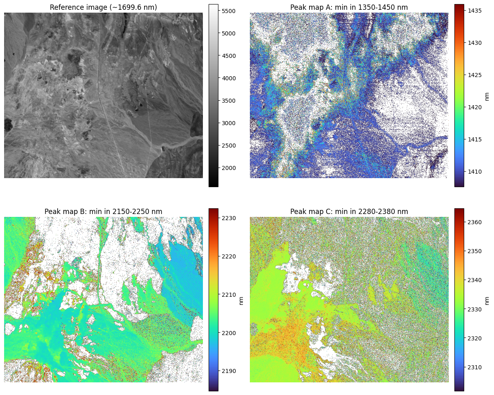

# PeakFit

Fast, practical peak-position mapping for hyperspectral rock data.

## Motivation
In core scanning and close-range SWIR work, we often care about **small wavelength shifts** (a few nm) in absorption features. Those shifts can track mineral chemistry, hydration state, and alteration intensity. The challenge is scale: we need robust sub-band peak estimates over many spectra (or full cubes) without slow per-pixel workflows.

This repo focuses on:
- fast peak/minimum estimation with quadratic interpolation,
- explicit tests of sampling-spacing error,
- spatial peak mapping over full hyperspectral scans.

## How Peak Position Is Computed
For each selected wavelength window, we fit a local quadratic:

$$
y = a x^2 + b x + c
$$

and use the analytic extremum location:

$$
x_{\mathrm{ext}} = -\frac{b}{2a}
$$

- if `mode="min"`, we require `a > 0`;
- if `mode="max"`, we require `a < 0`.

This gives sub-sample (sub-band) peak position from sampled spectra.

Implementation details live in:
- `src/peakfit/refine.py`
- `src/peakfit/polynomial.py`
- `src/peakfit/cube.py`

## Figures From The Notebook
All figures below come from `notebooks/peakfit_lab_swir.ipynb`.

### 1. Lab SWIR example (pairwise spectra + fitted feature positions)


### 2. Synthetic sampling-spacing error (p95 error + success rate)


### 3. Feature-width sensitivity vs spacing
Narrower features fail earlier as spacing increases.


### 4. Applied two-spectrum spacing test
Same stress-test setup on measured spectra (anonymous labels).


### 5. Full-cube peak maps (three windows)
Spatial variability of fitted minima over a full cube scan.



### 6. External close-range scans (new source)
Peak maps on external close-range rock scans.


## Sampling-Error Investigation (What to Look For)
The notebook quantifies, for each spacing:
- **p95 absolute error**: 95% of fits are within this many nm of reference,
- **success rate**: fraction of phase-offset trials with a valid fit.

This gives a direct stability threshold for instrument spacing vs required peak precision.

## Run
```bash
uv sync --all-groups
uv run jupyter notebook notebooks/peakfit_lab_swir.ipynb
```

## Docker CI Stages
Multi-stage Docker targets are provided for lint, build, and tests.

```bash
# Lint (ruff)
docker build --target lint -t peakfit:lint .

# Build wheel/sdist
docker build --target build -t peakfit:build .

# Run tests
docker build --target test -t peakfit:test .
```
