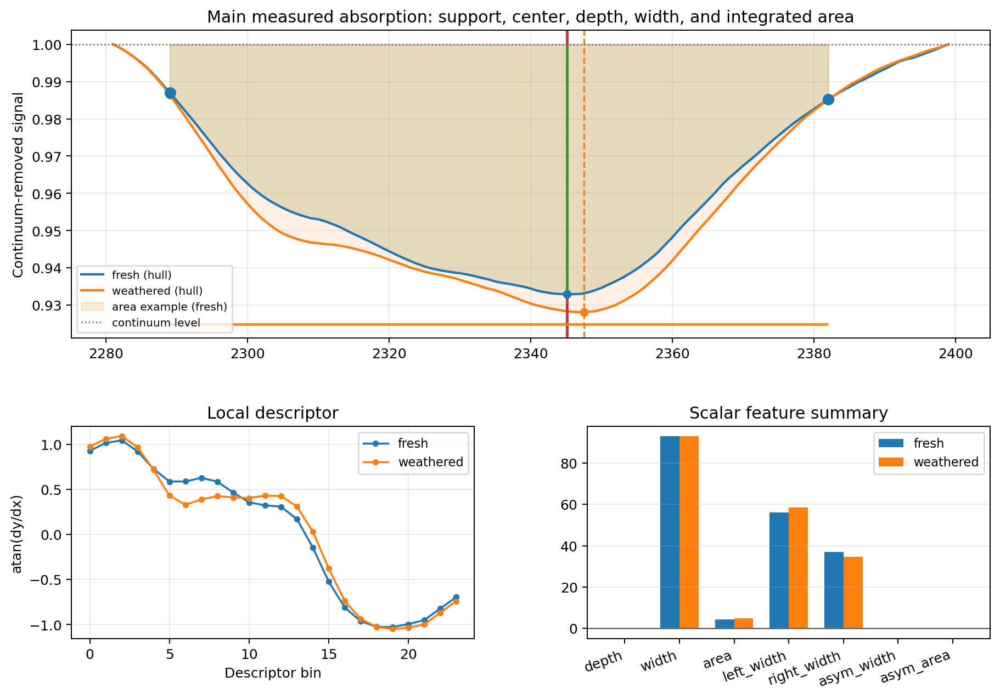
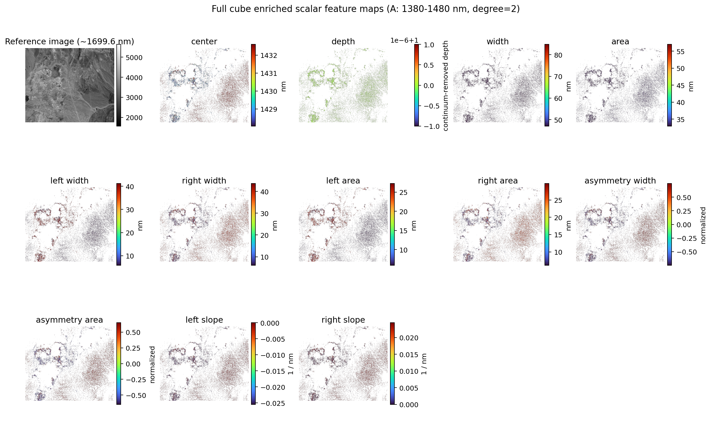
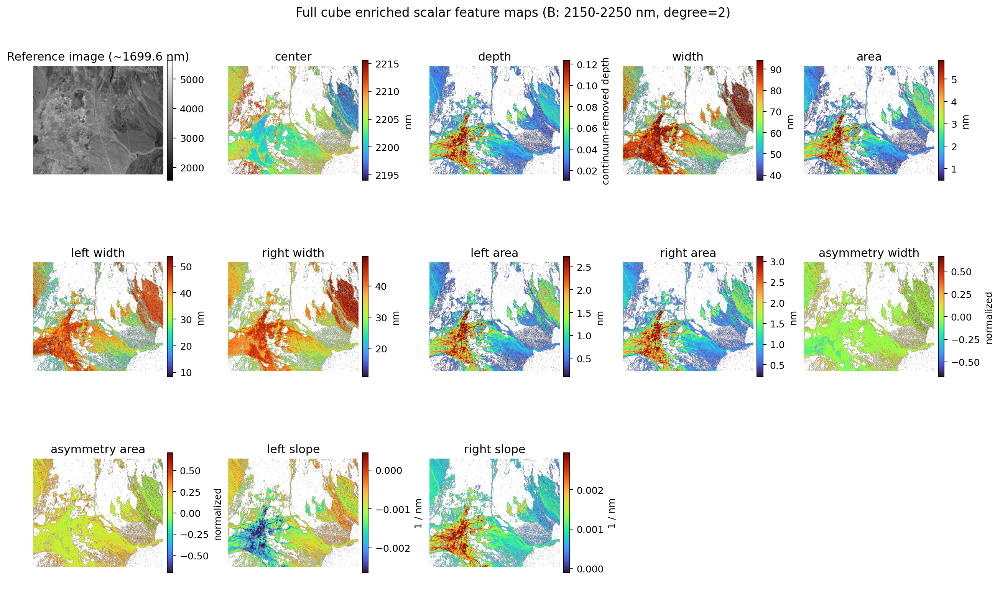
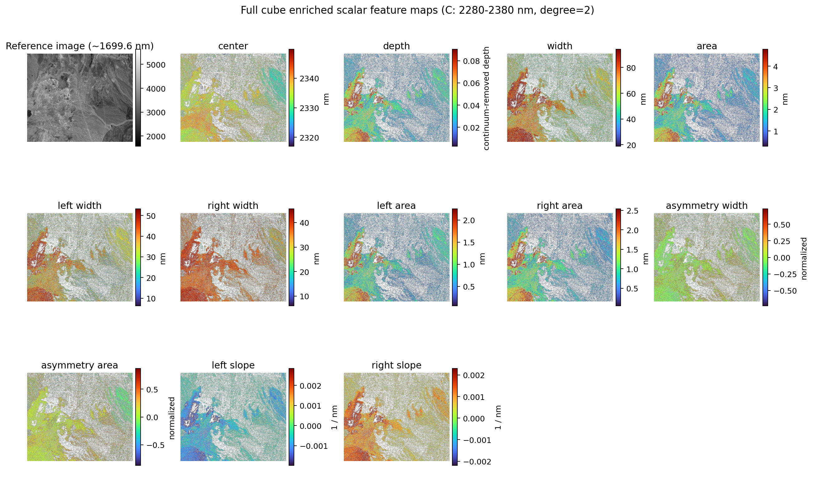
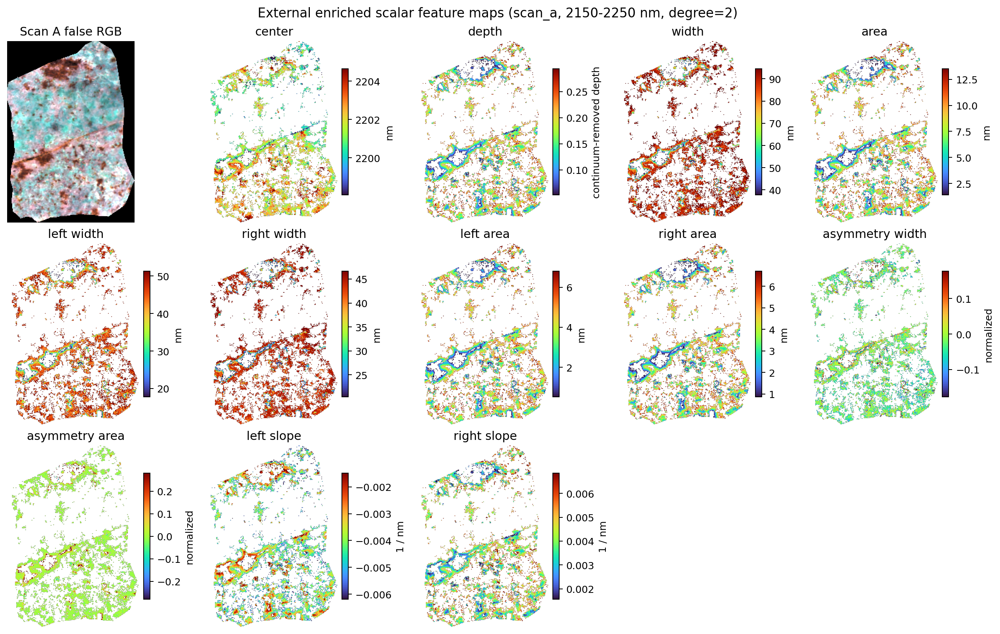
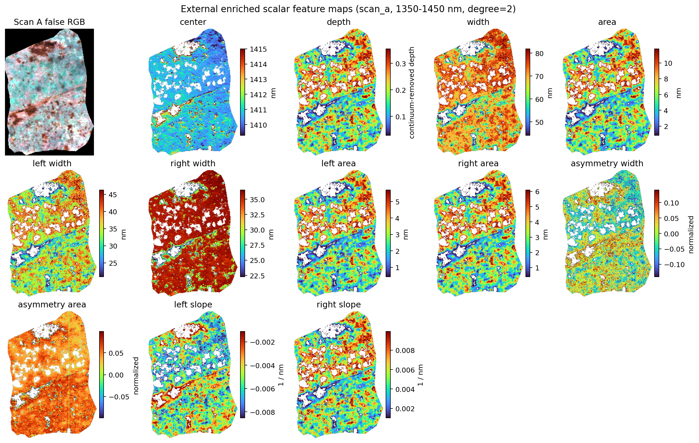
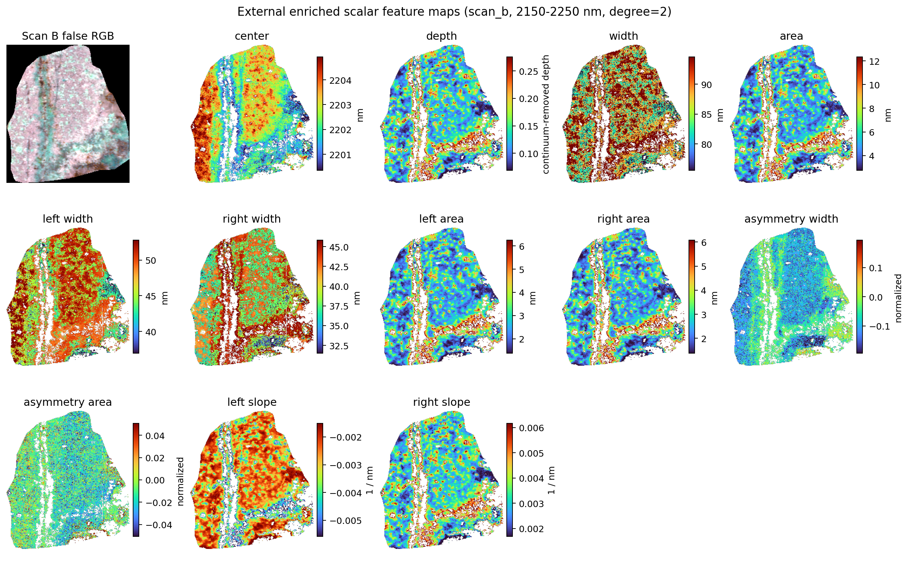
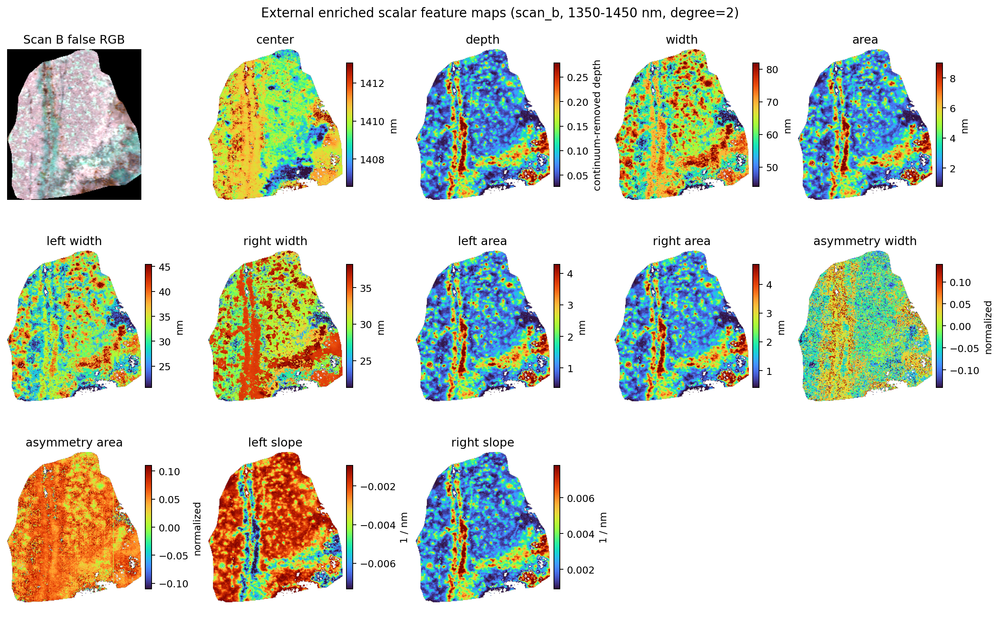
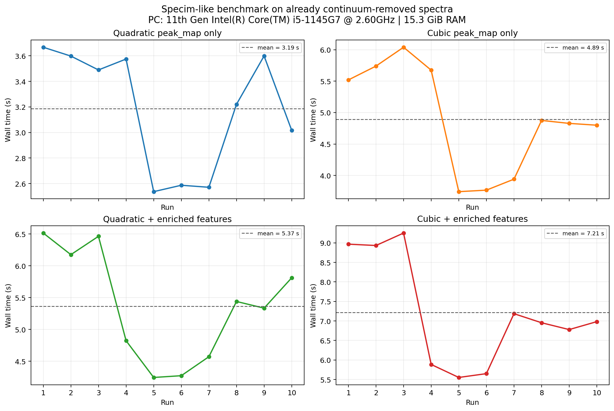

# PeakFit

Fast, practical sub-band extremum mapping for hyperspectral rock data.

## Motivation
In core scanning and close-range SWIR work, small wavelength shifts (often just a few nm) are meaningful. This project focuses on estimating those shifts quickly and consistently across many spectra or full data cubes.

## What This Repo Does
- continuum removal (none, linear, or hull) as a separate preprocessing step,
- local polynomial extremum fitting (quadratic and cubic),
- enriched absorption-feature extraction from detected valleys,
- sampling-spacing and feature-width stress tests,
- full-cube spatial extremum maps,
- side-by-side quadratic vs cubic comparisons.

Core implementation:
- `src/peakfit/continuum.py`
- `src/peakfit/features.py`
- `src/peakfit/refine.py`
- `src/peakfit/polynomial.py`
- `src/peakfit/cube.py`

## Data Sources
This project uses two external datasets in the notebook:

1. **USGS spectral library / lab spectra**  
   - Becker et al., *VNIR and SWIR Spectra of Select Altered Mafic and Ultramafic Rock Samples*  
   - DOI: https://doi.org/10.5066/P146B9KF  
   - File used: `ASD_FieldSpec6056.CSV`  
   - Coverage is VNIR+SWIR in source, and the notebook explicitly subsets to **SWIR** for analysis.

2. **External close-range ENVI cubes**  
   - Repository: https://github.com/panjoel4/ML-MineralMapping-Hyperspectral  
   - Files used: `10a_101012-120551_refl_ss.*`, `60a_101012-114407_refl_ss.*`  
   - Repository docs describe **SWIR** coverage around **1043–2486 nm**.  
   - Note: these ENVI headers do not contain explicit wavelength vectors, so the notebook uses a linear 1043–2486 nm axis across bands.

## References
- Saeid Asadzadeh, Carlos Roberto de Souza Filho, *Iterative Curve Fitting: A Robust Technique to Estimate the Wavelength Position and Depth of Absorption Features From Spectral Data*, IEEE Transactions on Geoscience and Remote Sensing, 2016. DOI: https://doi.org/10.1109/TGRS.2016.2577621

## Extremum Model
For a local quadratic fit:

$$
y = a x^2 + b x + c
$$

the analytic extremum is:

$$
x_{\mathrm{ext}} = -\frac{b}{2a}
$$

Cubic fits are also supported and use derivative roots plus curvature checks to select valid extrema.

## Enriched Feature Model
Once a local absorption center has been found, the enriched feature workflow measures a broader set of shape descriptors on the same window:

- `center`: the polynomial-refined trough wavelength,
- `support`: left and right shoulders bracketing the valley,
- `depth`: the continuum-to-center drop, `1 - y_cr(center)`,
- `width`: the shoulder-to-shoulder span,
- `area`: integrated absorption strength, `∫ (1 - y_cr) dx`,
- `left_*` and `right_*`: feature width, area, and slope split at the center,
- `asymmetry_*`: normalized left-vs-right difference,
- `descriptor`: a compact tangent-angle sequence on the normalized support.

Conceptually, the method is:

1. remove the continuum once inside the selected window,
2. locate the trough center with the same quadratic/cubic local estimator,
3. find shoulders that bracket the valley,
4. compute scalar geometry from that support interval,
5. optionally compute a compact local-shape descriptor.

## Figures From The Notebook
All figures are generated by `notebooks/peakfit_lab_swir.ipynb`.

### 1. Lab SWIR overview (raw + continuum-removed)


### 1b. Lab SWIR enriched feature example
This figure uses quiet colored overlays to highlight the main measured absorption geometry, while the accompanying notebook text directly below the figure explains what each overlay means and how the quantities are computed.


### 2. Synthetic spacing stress test (error + success)


### 3. Feature-width vs spacing sensitivity


### 4. Applied two-spectrum spacing test


### 5. Full-cube minima maps: quadratic vs cubic
Quadratic:


Cubic:


### 5b. Full-cube enriched scalar feature maps
These figures reuse the detected minima as centers and map scalar absorption properties per valid pixel for each full-cube window.

Window A:


Window B:


Window C:


### 6. External close-range maps: quadratic vs cubic
Quadratic:


Cubic:


### 6b. External close-range enriched scalar feature maps
These figures show the same scalar feature families on the external SWIR scans, aligned to the scan geometry.

Scan A, window 1:


Scan A, window 2:


Scan B, window 1:


Scan B, window 2:


## GIF Demos (Iterative Refinement)
### Symmetric synthetic walkthrough (quadratic)


### Asymmetric synthetic walkthrough (quadratic)


### Asymmetric synthetic walkthrough (cubic)


### 7. Noise robustness (symmetric + asymmetric; absolute error)
This figure combines:
- top row: example noisy curves,
- bottom row: absolute error `|estimated - true|`.


## Run
```bash
uv sync --all-groups
uv run pytest -q tests
uv run jupyter notebook notebooks/peakfit_lab_swir.ipynb
```

## Custom Data Examples
### ENVI (`.hdr` + `.dat`/`.raw`)
```python
from pathlib import Path
import numpy as np
from peakfit import peak_map


def parse_envi_hdr_text(text: str) -> dict[str, str]:
    out: dict[str, str] = {}
    for raw in text.splitlines():
        line = raw.strip()
        if not line or line.lower() == "envi" or "=" not in line:
            continue
        k, v = line.split("=", 1)
        out[k.strip().lower()] = v.strip()
    return out


def envi_dtype(code: int, byte_order: int) -> np.dtype:
    dt_map = {
        1: np.uint8,
        2: np.int16,
        3: np.int32,
        4: np.float32,
        5: np.float64,
        12: np.uint16,
        13: np.uint32,
        14: np.int64,
        15: np.uint64,
    }
    dt = np.dtype(dt_map[code])
    if dt.itemsize > 1:
        dt = dt.newbyteorder("<" if byte_order == 0 else ">")
    return dt


def load_envi_cube(hdr_path: Path, dat_path: Path) -> tuple[np.ndarray, np.ndarray]:
    meta = parse_envi_hdr_text(hdr_path.read_text(errors="ignore"))
    samples = int(meta["samples"])
    lines = int(meta["lines"])
    bands = int(meta["bands"])
    offset = int(meta.get("header offset", "0"))
    interleave = meta.get("interleave", "bil").lower()
    dtype_code = int(meta.get("data type", "4"))
    byte_order = int(meta.get("byte order", "0"))

    wl_text = meta.get("wavelength", "").strip("{} ")
    wavelengths = np.array([float(x) for x in wl_text.split(",") if x.strip()], dtype=np.float64)
    if wavelengths.size == 0:
        raise ValueError("No wavelength list in ENVI header")

    # Convert microns -> nm if needed.
    if wavelengths.max() < 100.0:
        wavelengths = wavelengths * 1000.0

    dt = envi_dtype(dtype_code, byte_order)
    arr = np.fromfile(dat_path, dtype=dt)
    if offset > 0:
        arr = arr[offset // dt.itemsize :]

    expected = lines * samples * bands
    arr = arr[:expected]

    if interleave == "bil":
        cube = arr.reshape(lines, bands, samples).transpose(0, 2, 1)
    elif interleave == "bsq":
        cube = arr.reshape(bands, lines, samples).transpose(1, 2, 0)
    elif interleave == "bip":
        cube = arr.reshape(lines, samples, bands)
    else:
        raise ValueError(f"Unsupported interleave: {interleave}")

    return cube.astype(np.float32, copy=False), wavelengths


cube, wl_nm = load_envi_cube(Path("scan.hdr"), Path("scan.dat"))  # or scan.raw
b0 = int(np.searchsorted(wl_nm, 2150.0, side="left"))
b1 = int(np.searchsorted(wl_nm, 2250.0, side="right"))
peak_nm, valid = peak_map(
    cube,
    wl_nm,
    b0,
    b1,
    degree=2,              # 2 or 3
    n_iterations=3,
    half_width=4,
    mode="min",            # "min" for absorption troughs after CR
    continuum="none",      # or "linear" / "hull"
    output_wavelength=True,
)
```

### NumPy cube (`.npy`)
```python
import numpy as np
from peakfit import load_cube_npy, peak_map

cube = load_cube_npy("cube.npy")                  # shape: (rows, cols, bands)
wl_nm = np.linspace(1000.0, 2500.0, cube.shape[2])  # replace with real wavelengths if available

b0 = int(np.searchsorted(wl_nm, 2150.0, side="left"))
b1 = int(np.searchsorted(wl_nm, 2250.0, side="right"))

peak_nm, valid = peak_map(
    cube,
    wl_nm,
    b0,
    b1,
    degree=3,
    n_iterations=3,
    half_width=4,
    mode="min",
    continuum="none",
    output_wavelength=True,
)
```

### Compute and plot enriched features from NumPy input
```python
import matplotlib.pyplot as plt
import numpy as np

from peakfit import extract_absorption_feature

# 1-D spectrum and wavelength axis.
wl_nm = np.linspace(2150.0, 2250.0, 101)
y = 1.0 - 0.08 * np.exp(-0.5 * ((wl_nm - 2217.4) / 8.0) ** 2)

feature = extract_absorption_feature(
    wl_nm,
    y,
    degree=2,
    continuum="none",      # use "linear" or "hull" for raw spectra
    n_iterations=3,
    half_width=4,
)

print("center:", feature.support.center_x)
print("depth:", feature.metrics.depth)
print("width:", feature.metrics.width)
print("area:", feature.metrics.area)

plt.figure(figsize=(8, 4))
plt.plot(wl_nm, feature.continuum_removed, lw=1.8, label="continuum-removed")
plt.axvline(feature.support.center_x, color="tab:red", ls="--", label="center")
plt.scatter(
    [feature.support.left_x, feature.support.right_x],
    np.interp(
        [feature.support.left_x, feature.support.right_x],
        wl_nm,
        feature.continuum_removed,
    ),
    color="tab:blue",
    zorder=3,
    label="support",
)
plt.fill_between(
    wl_nm,
    feature.continuum_removed,
    1.0,
    where=(wl_nm >= feature.support.left_x) & (wl_nm <= feature.support.right_x),
    alpha=0.15,
    color="goldenrod",
    label="area",
)
plt.title("Enriched absorption feature")
plt.xlabel("Wavelength (nm)")
plt.ylabel("Continuum-removed signal")
plt.grid(True, alpha=0.25)
plt.legend()
plt.tight_layout()
plt.show()
```

### Plot the peak map
```python
import numpy as np
import matplotlib.pyplot as plt

# peak_nm, valid come from peak_map(...)
peak_plot = np.where(valid, peak_nm, np.nan)

# Robust color limits for stable visual comparison.
vmin, vmax = np.nanpercentile(peak_plot, [2, 98])

plt.figure(figsize=(8, 5))
im = plt.imshow(peak_plot, cmap="turbo", vmin=vmin, vmax=vmax)
plt.title("Peak position map (nm)")
plt.axis("off")
plt.colorbar(im, label="Wavelength (nm)")
plt.tight_layout()
plt.show()
```

## Docker CI Stages
```bash
# Lint (ruff)
docker build --target lint -t peakfit:lint .

# Build wheel/sdist
docker build --target build -t peakfit:build .

# Run tests
docker build --target test -t peakfit:test .
```

## References
Polynomial fitting for absorption feature localization has been used in hyperspectral spectroscopy, for example:

Rodger, A., Laukamp, C., Haest, M., & Cudahy, T. (2012).  
*A simple quadratic method of absorption feature wavelength estimation in continuum-removed spectra.*  
Remote Sensing of Environment, 118, 273-283.  
https://doi.org/10.1016/j.rse.2011.11.015

Guo, B., Gunn, S. R., Damper, R. I., & Nelson, J. D. B. (2020).  
*Enriching absorption features for hyperspectral materials identification.*  
Optics Express, 28(3), 4127-4144.  
https://doi.org/10.1364/OE.384580

## License
This project is licensed under the MIT License. See [LICENSE](LICENSE).

## Performance Benchmark


This benchmark times four configurations on a synthetic Specim SWIR-like cube with shape `384 x 3000 x 288`, using an absorption window of about `20` bands across `100 nm`.

- `Quadratic peak_map only`
- `Cubic peak_map only`
- `Quadratic + enriched features`
- `Cubic + enriched features`

Benchmark assumptions:

- spectra are already continuum-removed,
- both `peak_map(...)` and `absorption_feature_map(...)` run with `continuum="none"`,
- enriched runs include the full scalar feature extraction pass after the peak map,
- each configuration is repeated `10` times and plotted run-by-run.

Measured means on this PC:

- `Quadratic peak_map only`: `3.42 s`
- `Cubic peak_map only`: `5.39 s`
- `Quadratic + enriched features`: `5.32 s`
- `Cubic + enriched features`: `7.76 s`

Benchmark PC:

- CPU: `11th Gen Intel(R) Core(TM) i5-1145G7 @ 2.60GHz`
- RAM: `15.3 GiB`
